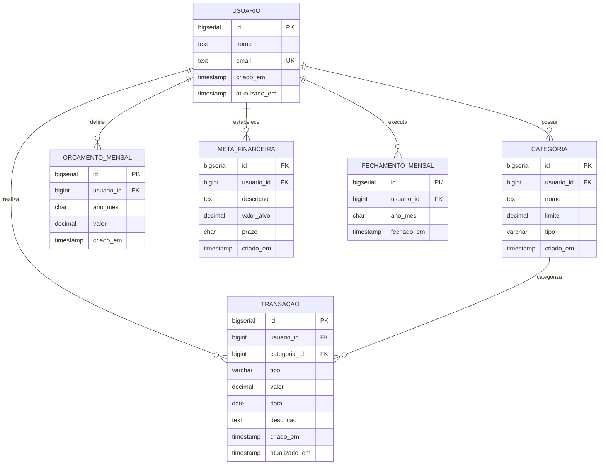

# MODELO ENTIDADE-RELACIONAMENTO (MER)
# Sistema de Finanças Pessoais

## ENTIDADES E RELACIONAMENTOS



## 📋 ESPECIFICAÇÃO DAS ENTIDADES

### 👤 **USUARIO**
| Campo | Tipo | Restrições | Descrição |
|-------|------|------------|-----------|
| id | BIGSERIAL | PK, NOT NULL | Identificador único |
| nome | TEXT | NOT NULL | Nome completo do usuário |
| email | TEXT | UNIQUE, NOT NULL | Email único no sistema |
| criado_em | TIMESTAMP | NOT NULL, DEFAULT NOW() | Data de criação |
| atualizado_em | TIMESTAMP | DEFAULT NOW() | Data da última atualização |

**Regras de Negócio:**
- Email deve ser único no sistema
- Nome não pode ser vazio
- Soft delete não implementado (cascata física)

---

### 🏷️ **CATEGORIA**
| Campo | Tipo | Restrições | Descrição |
|-------|------|------------|-----------|
| id | BIGSERIAL | PK, NOT NULL | Identificador único |
| usuario_id | BIGINT | FK, NOT NULL | Referência ao usuário |
| nome | TEXT | NOT NULL | Nome da categoria |
| limite | DECIMAL(14,2) | NOT NULL, CHECK >= 0 | Limite mensal da categoria |
| tipo | VARCHAR(10) | NOT NULL, CHECK IN('ESSENCIAL','SUPERFLUO') | Tipo da categoria |
| criado_em | TIMESTAMP | NOT NULL, DEFAULT NOW() | Data de criação |

**Restrições:**
- UNIQUE (usuario_id, nome) - Nome único por usuário
- FOREIGN KEY usuario_id REFERENCES usuario(id) ON DELETE CASCADE
- CHECK (limite >= 0)
- CHECK (tipo IN ('ESSENCIAL', 'SUPERFLUO'))

**Regras de Negócio:**
- Usuário não pode ter categorias com mesmo nome
- Limite sempre positivo ou zero
- Tipo determina prioridade nas regras de gastos

---

### 💰 **TRANSACAO**
| Campo | Tipo | Restrições | Descrição |
|-------|------|------------|-----------|
| id | BIGSERIAL | PK, NOT NULL | Identificador único |
| usuario_id | BIGINT | FK, NOT NULL | Referência ao usuário |
| categoria_id | BIGINT | FK, NULL | Referência à categoria (NULL para receitas) |
| tipo | VARCHAR(8) | NOT NULL | RECEITA ou DESPESA |
| valor | DECIMAL(14,2) | NOT NULL, CHECK > 0 | Valor da transação |
| data | DATE | NOT NULL | Data da transação |
| descricao | TEXT | NULL | Descrição opcional |
| criado_em | TIMESTAMP | NOT NULL, DEFAULT NOW() | Data de criação |
| atualizado_em | TIMESTAMP | DEFAULT NOW() | Data da última atualização |

**Restrições:**
- FOREIGN KEY usuario_id REFERENCES usuario(id) ON DELETE CASCADE
- FOREIGN KEY categoria_id REFERENCES categoria(id) ON DELETE SET NULL
- CHECK (valor > 0)
- CHECK (tipo IN ('RECEITA', 'DESPESA'))
- INDEX (usuario_id, data) - Consultas por usuário e período

**Regras de Negócio:**
- Valor sempre positivo (sinal determinado pelo tipo)
- Data não pode ser futura
- Categoria obrigatória apenas para despesas
- Não pode ser editada/excluída após fechamento mensal

---

### 📊 **ORCAMENTO_MENSAL**
| Campo | Tipo | Restrições | Descrição |
|-------|------|------------|-----------|
| id | BIGSERIAL | PK, NOT NULL | Identificador único |
| usuario_id | BIGINT | FK, NOT NULL | Referência ao usuário |
| ano_mes | CHAR(7) | NOT NULL | Período no formato YYYY-MM |
| valor | DECIMAL(14,2) | NOT NULL, CHECK >= 0 | Valor do orçamento mensal |
| criado_em | TIMESTAMP | NOT NULL, DEFAULT NOW() | Data de criação |

**Restrições:**
- FOREIGN KEY usuario_id REFERENCES usuario(id) ON DELETE CASCADE
- UNIQUE (usuario_id, ano_mes) - Um orçamento por mês por usuário
- CHECK (valor >= 0)
- CHECK (ano_mes ~ '^[0-9]{4}-[0-9]{2}$') - Formato YYYY-MM

**Regras de Negócio:**
- Apenas um orçamento por usuário por mês
- Valor não pode ser negativo
- Controla limite total de gastos mensais

---

### 🎯 **META_FINANCEIRA**
| Campo | Tipo | Restrições | Descrição |
|-------|------|------------|-----------|
| id | BIGSERIAL | PK, NOT NULL | Identificador único |
| usuario_id | BIGINT | FK, NOT NULL | Referência ao usuário |
| descricao | TEXT | NOT NULL | Descrição da meta |
| valor_alvo | DECIMAL(14,2) | NOT NULL, CHECK > 0 | Valor objetivo |
| prazo | CHAR(7) | NOT NULL | Prazo no formato YYYY-MM |
| criado_em | TIMESTAMP | NOT NULL, DEFAULT NOW() | Data de criação |

**Restrições:**
- FOREIGN KEY usuario_id REFERENCES usuario(id) ON DELETE CASCADE
- CHECK (valor_alvo > 0)
- CHECK (prazo ~ '^[0-9]{4}-[0-9]{2}$') - Formato YYYY-MM

**Regras de Negócio:**
- Valor alvo sempre positivo
- Prazo deve ser futuro em relação à criação
- Permite múltiplas metas simultâneas

---

### 🔒 **FECHAMENTO_MENSAL**
| Campo | Tipo | Restrições | Descrição |
|-------|------|------------|-----------|
| id | BIGSERIAL | PK, NOT NULL | Identificador único |
| usuario_id | BIGINT | FK, NOT NULL | Referência ao usuário |
| ano_mes | CHAR(7) | NOT NULL | Período fechado YYYY-MM |
| fechado_em | TIMESTAMP | NOT NULL, DEFAULT NOW() | Data do fechamento |

**Restrições:**
- FOREIGN KEY usuario_id REFERENCES usuario(id) ON DELETE CASCADE
- UNIQUE (usuario_id, ano_mes) - Um fechamento por mês por usuário
- CHECK (ano_mes ~ '^[0-9]{4}-[0-9]{2}$') - Formato YYYY-MM

**Regras de Negócio:**
- Impede edição/exclusão de transações do período
- Apenas um fechamento por mês por usuário
- Fechamento é irreversível (exceto com permissões especiais)

## 🔍 **ÍNDICES PROPOSTOS**
```sql
-- Performance para consultas frequentes
CREATE INDEX idx_transacao_usuario_data ON transacao(usuario_id, data);
CREATE INDEX idx_transacao_categoria_data ON transacao(categoria_id, data);
CREATE INDEX idx_categoria_usuario_tipo ON categoria(usuario_id, tipo);
CREATE INDEX idx_orcamento_usuario_mes ON orcamento_mensal(usuario_id, ano_mes);
CREATE INDEX idx_meta_usuario_prazo ON meta_financeira(usuario_id, prazo);
```
